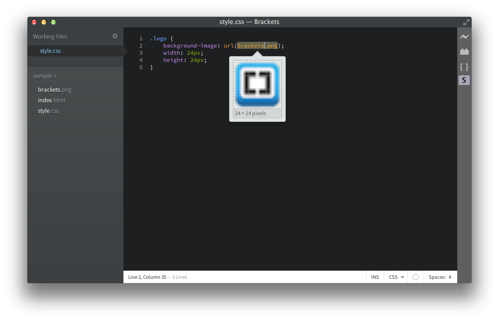
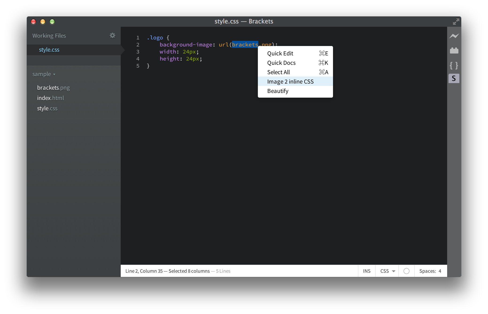
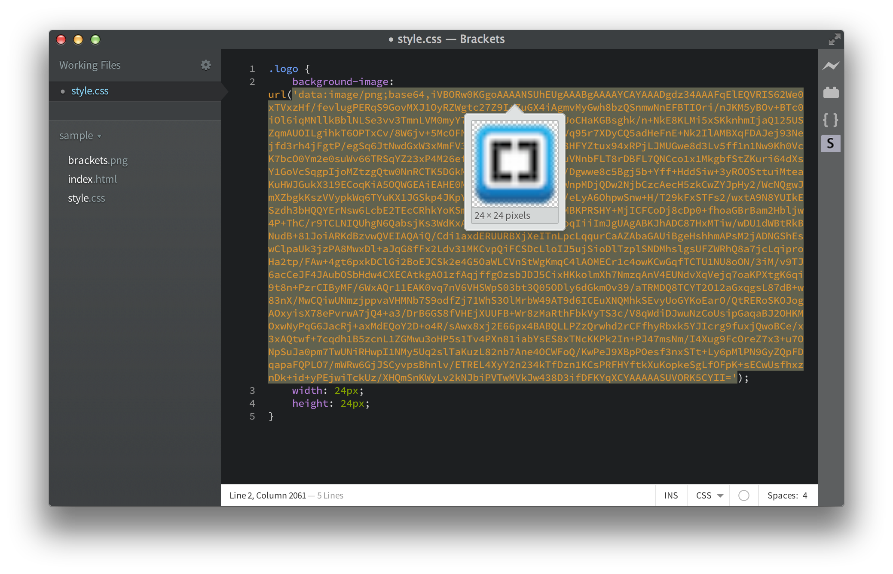

Brackets - Image Inline CSS/HTML
=========================
Convert any image to base64 encoded inline in HTML or CSS file!
<ul>
<li>Convert CSS <pre>url(file.png)</pre> to <pre>url(data:image/png;base64...)</pre></li>
<li>HTML Image Tags <pre>&lt;img src="file.png"&gt;</pre> to <pre>&lt;img src="data:image/png;base64,..."&gt;</pre></li>
</ul>

Screenshots
===========

### STEP 1

### STEP 2

### STEP 3
